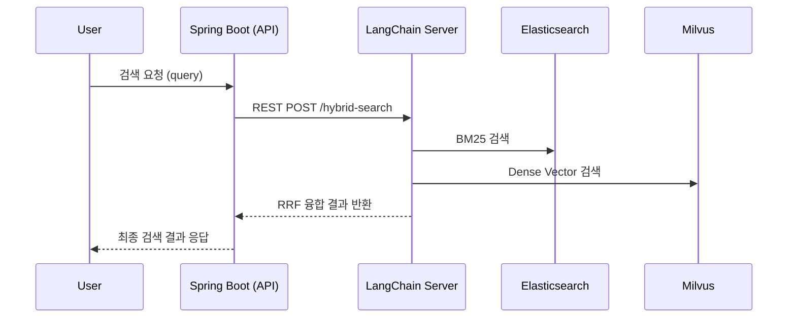

# LLM RAG Demo (AI 검색 시스템)

| 항목 | 내용                                                                                                         |
| ---- |------------------------------------------------------------------------------------------------------------|
| **프로젝트명** | AI 검색 시스템 RAG Demo 구축 (사내 PoC)                                                                             |
| **기술 구성** | Python, LangChain, Elasticsearch, Milvus, HuggingFace Embedding, Spring Boot, Jenkins, harbor, Docker, K8s |
| **서버 구조** | Private Cloud 환경 / Python 검색 서버 + Spring Boot 중계 서버                                                        |
| **주요 업무** | BM25 + Dense Vector 검색 융합, RRF 기반 순위 결합, LangChain Retriever 커스터마이징                                        |
| **데이터 흐름** | Query → Embedding → Vector DB 검색(Milvus) + BM25 검색 → Score Fusion(RRF) → Response                          |
| **성과 및 개선** | Hybrid Search(RRF) 구조 확립 및 중계 서버 설계, 검색 정확도 개선 & 내부 시연용 검색 품질 1위 기록                                        |


## 1) 프로젝트 개요
- **목표:** 사내 RFP 대응용 **검색-생성(RAG) 데모 플랫폼** 구현
- **구성**
  - **Spring Boot 중계 서버**: 인증, 요청 포맷, 예외 처리, 타임아웃 제어
  - **LangChain 검색 엔진**: Hybrid Search (BM25 + Dense Vector)
  - **Milvus / Elasticsearch**: 대규모 벡터 데이터와 키워드 기반 색인 관리
  - **Jenkins + Docker + K8s**: PoC를 넘어선 운영형 배포 파이프라인

- **핵심 포인트:**
    - **BM25(Elasticsearch) + Dense(Milvus)** 하이브리드 검색
    - **RRF(Ranked Retrieval Fusion)** 기반 결과 융합
    - **Spring Boot** 중계 API(인증/예외/타임아웃) ↔ **Python LangChain** 검색·생성 파이프라인
    - **Jenkins + Docker + K8s**로 PoC 수준 이상 **운영형 배포 플로우** 적용 



💡 왜 ES + Milvus?

ES: 키워드 정밀 매칭(BM25)·필터링·메타데이터 질의 강점
Milvus: 대규모 임베딩 벡터에 대한 근사 최근접(ANN) 검색 성능·스케일링 용이

두 결과를 RRF로 융합해 “키워드 적합성 × 의미 유사도” 균형 확보

## 2️) Hybrid Search 구조
> BM25와 Dense Vector 검색 결과를 RRF(Ranked Retrieval Fusion) 으로 융합해
키워드 적합성과 문맥적 유사도를 동시에 확보했습니다.

| 검색 방식 | 설명 | 장점 | 단점 |
|------------|------|------|------|
| **BM25 (Sparse)** | 전통적인 TF-IDF 기반 키워드 검색 | 빠른 속도, 정확한 키워드 매칭 | 문맥 인식 불가 |
| **Dense (Vector)** | 문장을 BERT 임베딩으로 변환 후 코사인 유사도 기반 검색 | 의미 기반 유사도 반영 | 계산량/메모리 부담 |
| **RRF 융합** | Reciprocal Rank Fusion으로 두 결과를 결합 | 두 검색의 장점을 융합 | 하이퍼파라미터(k) 조정 필요 |

💡 [문서 수집 → 전처리(chunk) → 임베딩 → 저장]
- BM25: ES 인덱스에 원문·메타데이터 저장
- Dense: 임베딩 생성 후 Milvus 컬렉션에 저장
  - Python/LangChain으로 임베딩 → **Elasticsearch dense_vector** 저장
  - Kibana DevTools로 인덱스/쿼리 검증


- BM25(ES) 결과와 Dense(Milvus) 결과를 받아 RRF로 융합 >> BM25 + 벡터 스코어 결합
- LangChain EnsembleRetriever 또는 커스텀 RRF로 구현

💡 **예시 코드 (실제 X)**
```python

def hybrid_search(collection_name, query, k):
    bm25_retriever = BM25Retriever.from_texts(docs)
    
    vector_retriever = Milvus(
        embedding_function=HuggingFaceEmbeddings(model_name=Config.MODEL_NAME,
                                                 encode_kwargs={'normalize_embeddings': True}),
        connection_args={"host": Config.MILVUS_HOST, "port": Config.MILVUS_PORT},
        collection_name=collection_name
    ).as_retriever()

    # 내부적으로 vector_retriever는 similarity_search_with_score_by_vector >> k=4
    ensemble_retriever = EnsembleRetriever(retrievers=[bm25_retriever, vector_retriever], weights=[0.X, 0.X])
    docs = ensemble_retriever.invoke(query)

    // 생략 
    
    return docs

```


## 3) 중계 서버(Spring Boot) & 통신 안정화
>Spring Boot 기반 중계 서버 전체 구조 세팅 및 공통 유틸리티 설계

- 프로젝트 초기 세팅: Gradle 멀티 모듈 구조, 공통 config, exception, response 패키지 구조 정의
- 공통 유틸 구성
  - ResponseHandler, GlobalExceptionHandler 작성으로 예외 및 응답 형식 통일
  - RestClientUtil 커스텀 래퍼 작성 — 외부 LangChain 서버·RAG API 간 공통 호출 로직
- WebClient 기반 외부 연동 구조 설계
  - .block() 기반 동기 호출 방식으로 PoC 안정성 확보
  - 추후 논블로킹 구조 확장 대비한 WebClient 도입
- 메시지 포맷 통일화
  - ChatResponse, PromptMessage 등 VO 정의 및 JSON 직렬화 규칙 통일 
- Jenkins 파이프라인 구성


## 4) 배포 자동화

> Jenkins 기반의 CI/CD 파이프라인을 설계하여
테스트 → 빌드 → 이미지 푸시 → 배포 자동화를 구현했습니다.

- Build → Docker Image → K8s 배포까지 자동화 파이프라인 구축 및 운영
- Harbor 레지스트리 업로드 → K8s 배포 자동화
- readinessProbe, livenessProbe 구성으로 무중단 운영


## 3) 산출물
- RAG 파이프라인 가이드/노트북 정리